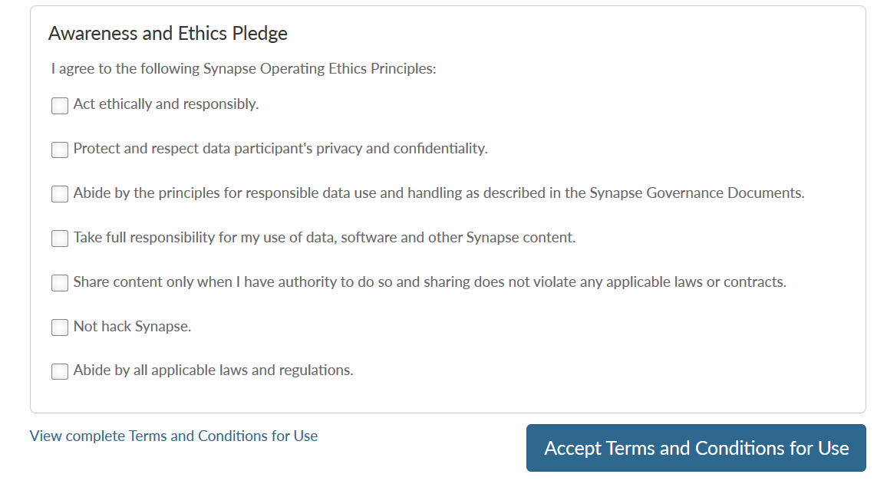
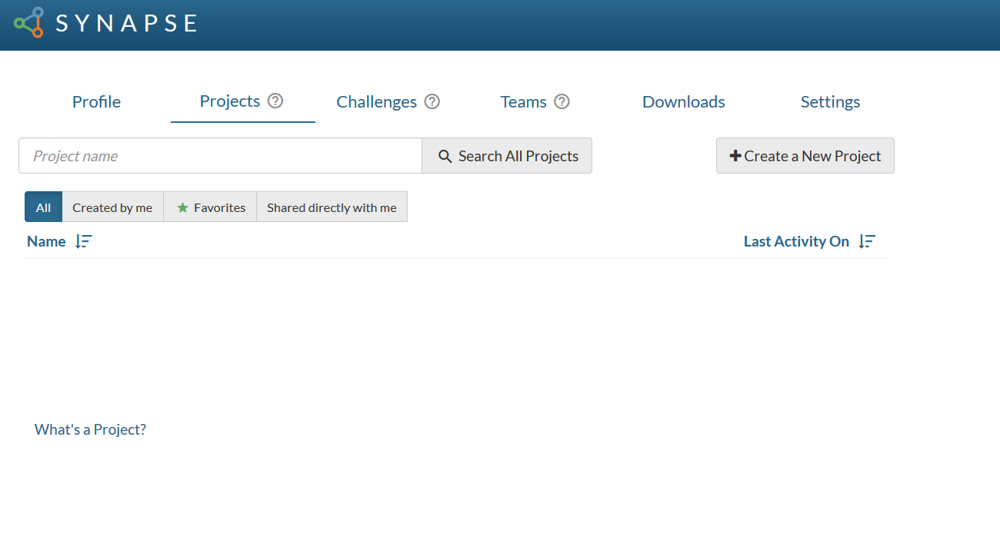
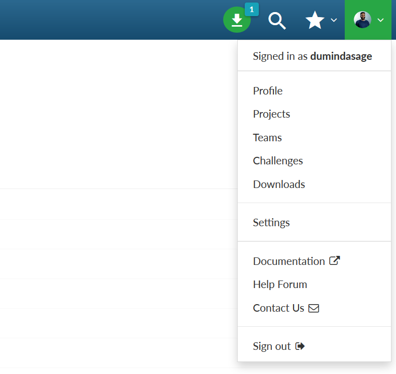
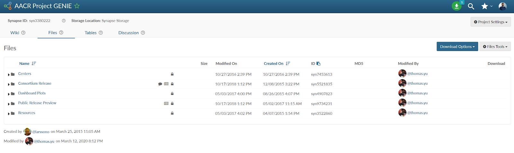
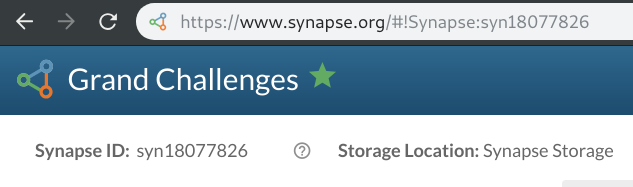

Welcome to Synapse! We are happy to have you as part of the Synapse Community. 

This guide is for new Synapse users and takes 10 minutes to read.

You will learn:
 
* How to set up your Synapse account.
* The steps to get started with core Synapse features.
* This guide will focus on using Synapse on the web. Many researchers also use Synapse with R, Python or Command Line tools. See [Getting Started with Synapse APIs]({{ site.baseurl }}).

## What is Synapse?

Synapse is a research application developed by [Sage Bionetworks](https://sagebionetworks.org/). Using Synapse, you can find, upload, track, discuss and download datasets and analyses. Synapse supports all kinds of working groups: individuals, small teams, and large consortia.
For more information, see Introduction to the Sage Platform

## Setting Up Synapse

### Create your account
Anyone can browse public projects on Synapse without creating an account. However, to download files and create new content, you will need to make an account.
You can register using an email address, or your Google account. 

After registering, you will receive an email to verify your account. You must accept the Terms and Conditions of use to proceed.

## [Register](https://www.synapse.org/#!RegisterAccount:0)

### Your first time on the Synapse Dashboard

After accepting the Terms and Conditions of use, you will arrive at the `Projects` tab of your Dashboard. Synapse Projects are online workspaces where researchers can collaborate and organize their work. 

All of your Projects are stored here, whether you join an existing one or create a new Project. Data, Wikis and Discussions are contained in each Project. We’ll discuss more about [Projects later on in this guide]({{ site.baseurl }}#projects).

From your dashboard you can also:
 
* View your Profile
* See Challenges you are registered for
* See the Teams you are a member of
* Access your Downloads list 
* Change your Settings

You can access all of these tabs from the User Menu as well. 

## Governance and Access to Data
Before exploring Synapse, it is important to get an understanding of Governance and Access Privileges. This will ensure that you are able to use Synapse in an ethical and compliant way.

### Governance
Misuse of human health data can result in severe ethical and legal issues. This means that all Synapse users must comply with privacy and security standards. 
The Governance team at Sage Bionetworks has created policies that maintain these standards. These policies specify Synapse users’ rights and responsibilities. They include conditions for who can use and access data. They also specify the rights and responsibilities of Sage Bionetworks and of the Synapse Access and Compliance Team (ACT).

[Learn more about Governance]({{ site.baseurl }}).

[Read the terms and Conditions of Use](https://s3.amazonaws.com/static.synapse.org/governance/SageBionetworksSynapseTermsandConditionsofUse.pdf?v=4).

[Learn more about Synapse Community Standards]({{ site.baseurl }}#synapse-community-standards). 

### User Types will Determine Access to Data

The way in which you will use Synapse, will depend on your own research needs and your Synapse User Type.

There are four User Types in Synapse. Each User Type has a different level of permission. 

These are:
* Anonymous users who do not have a Synapse account 
* Registered users who have created a Synapse account
* Certified users who have passed the certification quiz
* Validated users whose profile has been verified

The table below summarizes the user privileges for each level.
 
 {:.markdown-table}
|                                                          | Anonymous | Registered | Certified | Validated* |
| :--------------------------------------------------------: | :---------: | :----------: | :---------: | :----------: |
| Browse Public Project Catalogue                          | x         | x          | x         | x          |
| Browse Public File Catalog                               | x         | x          | x         | x          |
| Create a Project                                         |           | x          | x         | x          |
| Add Wiki Content                                         |           | x          | x         | x          |
| Download Files/Tables*                                   |           | x          | x         | x          |
| Upload Files/Tables                                      |           |            | x         | x          |
| Add Provenance                                           |           |            | x         | x          |
| Requesting access to data collected through research app |           |            |           | x          |

[Learn more about User Types]().

**Become a Certified User**

To upload files, you must become a Certified User. This demonstrates that you have awareness of privacy and security issues. You can become certified at any time by taking a short quiz. If you try to upload files without becoming certified, Synapse will prompt you to take the quiz.

After you become a Certified User, you can have your profile Validated.  A Validated profile means that your identity has been verified by the Sage Access and Compliance team. This allows you to access more features and data. Profile validation enables greater transparency within the research community.

Validation steps include:
* Filling out your profile
* Connecting your ORCID,
* Signing the oath, 
* Providing a recent identity attestation

Learn more about Certified and Validated Accounts.

## Projects

Now that you have briefly explored Synapse, it is time to learn a bit more about Projects.

### What is a Project?

A Project is a workspace that you can use to organize your work and collaborate with others. They act as “containers” and can group related objects such as content and people together.

Using Projects, you can: 
* Store content such as Data, Code, Results, Figures and Documents
* Organize your Files and Folders
* Link and share content with others 
* Create custom, searchable Annotations
* Create Tables
* Have discussions using a Forum
* Create Project Documentation using Wikis
* Control Access
* Release your work publicly

Any user can create multiple Projects. Each Project can be tailored to a specific workflow, using only the features needed for the Project.

[Learn more about Projects]({{ site.baseurl }}).

## Synapse ID

On the top left of your Project, you’ll notice a Synapse ID with the format “syn12345678”. Everything that is created in Synapse has a unique Synapse ID. The Synapse ID is often abbreviated to “synID”. The ID of an object never changes, even if the name does. 

The synID is always accessible in the URL and visible on the webpage. It is used for reference to any object in Synapse.

## What's Next?

Now that you have a basic understanding of how to start using Synapse you can learn more about how to use the core features with these tutorials below.

* I want to create a new project
* I want to upload my data and share it
* I want to download existing data
* I want to organize files in a project
* I want to create a New team 
* I want to download research data from mobile studies
* I want use Synapse programmatically

## Advanced Topics

### Practicing Version Control
All content in Synapse is versioned automatically, with the ability to provide version comments on files, and to link content together with rich provenance relationships. This is particularly useful for groups leveraging Synapse as a component of a data processing pipeline, or citing data for publications, as Synapse allows data contributors to mint DOIs for most content. Learn more versioning content, creating and managing provenance, and how to mint DOIs. 

### Custom Metadata
Synapse provides a number of default metadata fields that automatically annotate content with useful information, but also offers the ability for users to define their own metadata key-value pairs to provide context to their data. These annotations can be viewed and managed at the individual file level, or by creating “views” that show annotations on all content across a larger scope such as a project or folder. Learn more about annotations and views.  

### Search
Leverage Synapse global search to discover data, projects, or even potential collaborators! Search is permission-dependent, meaning it works across all public content and content that you have access to, if logged in.  Learn more about Searching. 